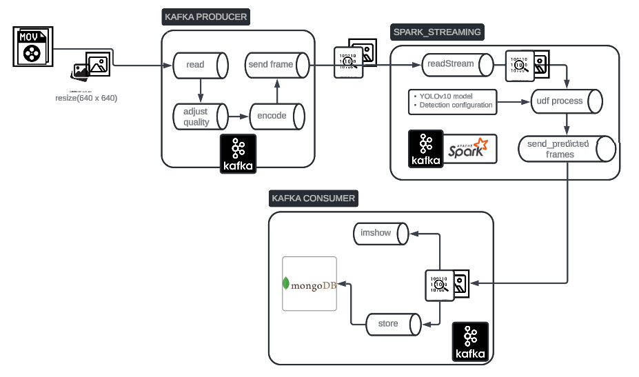

# Traffic Violation Detection with Spark and Kafka

![Project Banner]

## Table of Contents
- [Introduction](#introduction)
- [Features](#features)
- [Architecture](#architecture)
- [Installation](#installation)
- [Usage](#usage)
- [Configuration](#configuration)
- [Note](#note)
- [Contact](#contact)

## Introduction
The Traffic Violation Detection project uses Spark and Kafka to detect traffic violations in real-time from video streams. This project aims to provide a scalable and efficient solution for monitoring traffic and enforcing traffic rules.

## Features
- Real-time video stream processing
- Traffic violation detection using YOLOv10
- Scalable architecture with Apache Kafka and Spark
- Detailed logging and monitoring
- Easy configuration and deployment

## Architecture
The architecture of the project consists of the following components:
1. **Video Stream Producer**: Captures video frames and sends them to a Kafka topic.
2. **Spark Consumer**: Reads frames from Kafka, processes them with a UDF for bounding box prediction, and streams the processed frames to another Kafka topic.
3. **Processed Frame Consumer**: Reads processed frames from Kafka, displays them using OpenCV and stores in MongoDB.



## Installation
### Prerequisites
- Python 3.8+
- Apache Kafka (current version: 3.7.0)
- Apache Spark (current version: 3.5.1, scala: 2.12.18)
- JDK 11
- OpenCV

### Setup
1. Clone the repository:
    ```sh
    git clone https://github.com/boo283/Traffic_Violation_Detection.git
    ```

2. Create a virtual environment and activate it:
    ```sh
    python -m venv myenv
    source myenv/bin/activate  # On Windows, use `myenv\Scripts\activate`
    ```

3. Install the required packages:
    ```sh
    pip install -r requirements.txt
    ```

4. Start Kafka and create the required topics:
    - instruction in the file 'Traffic_Violation_Detection/docs/kafka_run.txt'

## Usage
### Replacing path in your folder
- detection.py: model_path, checkpoint_path
- kafka_producer: video_path, config_file_path
  
### Running the Video Stream Producer
```sh
python ./pipelines/kafka_producer.py
```
### Running the Spark Consumer (read Kafka-stream and predict)
```sh
python ./pipelines/detection.py
```
### Running the Consumer (show predicted IMG and save to MongoDB)
```sh
python ./pipelines/app.py
```
### You can modify kafka topics by using kafka-API
```sh
python ./pipelines/kafkaAPI.py
```

## Configuration
### All configurations are stored in the config directory. Key configuration files include:
-  kafka_config.yml: Kafka producer and consumer settings.
-  logging_config.yml: Logging settings.
-  Ensure you update these files according to your environment.
  
## Note
### Set up enviroment
- You have to set up SPARK, HADOOP, JAVA environment / system env paths
### Can not run kafka server
- Try to delete folder "C:/temp" and restart kafka
### KAFKA-1894 cautions
- Keep cool off and wait

## Contact
- LinkedIn: https://www.linkedin.com/in/phutrungnguyen283/ 
- Facebook: https://www.facebook.com/ngphtrungboo 
- Email: trung280302@gmail.com 
  
<strong> Feel free to adjust my code, practice makes perfect ❤️❤️❤️ <strong>

